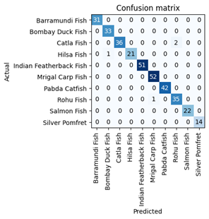

# south-asian-fish-recognition
Recognizes 10 different types of fishes that can be found in south asia:

| Image | Name |
|:------:|:-----|
|  | **Hilsa Fish** |
|  | **Rohu Fish** |
|  | **Catla Fish** |
|  | **Barramundi Fish** |
|  | **Mrigal Carp Fish** |
|  | **Indian Featherback Fish** |
|  | **Salmon Fish** |
|  | **Pabda Catfish** |
|  | **Silver Pomfret** |
|  | **Bombay Duck Fish** |

# Why did I make this?
I created South Asian Fish Recognition to solve a real problem I face at the local bazaar when buying fish. I wanted to know the fish’s name beforehand and check if the fish fits my taste before buying. This would help because I wouldn't end up purchasing something I didn't like.  

# Preparing Data
Data was collected from DuckDuckGo 
DataLoader was set up using the fast.ai DataBlock API 
fast.ai provided default data augumentation which operates in GPU. more details in 'notebooks/data_prepare.ipynb'  
# Data Training
### Model Benchmark
| Model         | Avg. Accuracy (%) |    Avg. Training Time   | Confusion Matrix |
| :------------ | :---------------: | :---------------------: | :------: |
| **ResNet-34** |     **98.58**     | **≈ 1 min 6 s / epoch** |  |
| **ResNet-50** |       94.42       |   ≈ 1 min 11 s / epoch  |  |
| **AlexNet**   |       94.02       |   ≈ 1 min 2 s / epoch  |  |

### Chosen Model - Resnet-34
Resnet-34 had the highest accuracy among the three and although it did have a higher average time than Alexnet, the tradeoff for a higher average accuracy makes it worth it. 

# Data Cleaning
Cleaned Data using fast.ai's ImageClassifierCleaner.  
The dataset initially had 3,772 images and after cleanning it reduced to 3,415. 

# Deploying the model
I deployed the model with HuggingFace Spaces Gradio App. The implementation is in the 'deployment' folder. It can also be found [here](https://huggingface.co/spaces/wrezachow/south-asian-fish-recognition)  

 

# API integration wit GitHub pages
deployed the model [here](https://github.com/wrezachow/south-asian-fish-recognition) in GitHub Pages Website. 
I used LLMs to generate some of the HTML and CSS for better visuals when uploading photos.
You can view the scripts in 'docs' part of the repo.

### Home page

