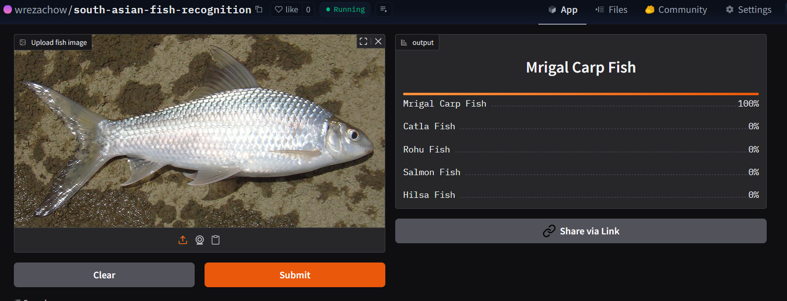

# fish-recognizer
Recognizes 10 different types of fishes:
1. Hilsa Fish
2. Rohu Fish
3. Catla Fish
4. Barramundi Fish
5. Mrigal Carp Fish
6. Indian Featherback Fish
7. Salmon Fish
8. Pabda Catfish
9. Silver Pomfret
10. Bombay Duck Fish

# Preparing Data
Data was collected from DuckDuckGo 
DataLoader was set up using the fast.ai DataBlock API 
fast.ai provided default data augumentation which operates in GPU. more details in 'notebooks/data_prepare.ipynb'  

# Data Training and Cleaning
Used resnet34 model to fine-tune for 3-5 epochs (9 times) to achieve up ~99% accuracy 
Cleaned Data using fast.ai's ImageClassifierCleaner. There was lots of junk images to clean that is one of the reasons why I have 9 models. 

# Deploying the model
I deployed the model with HuggingFace Spaces Gradio App. The implementation is in the 'deployment' folder. It can also be found [here](https://huggingface.co/spaces/wrezachow/fish-recognizer-1)  

 

# API integration wit GitHub pages
deployed the model [here](https://wrezachow.github.io/fish-recognizer) in GitHub Pages Website. 
I used GPT-5 to generate some of the HTML and CSS for better visuals when uploading photos.
You can view the scripts in 'docs' part of the repo.
