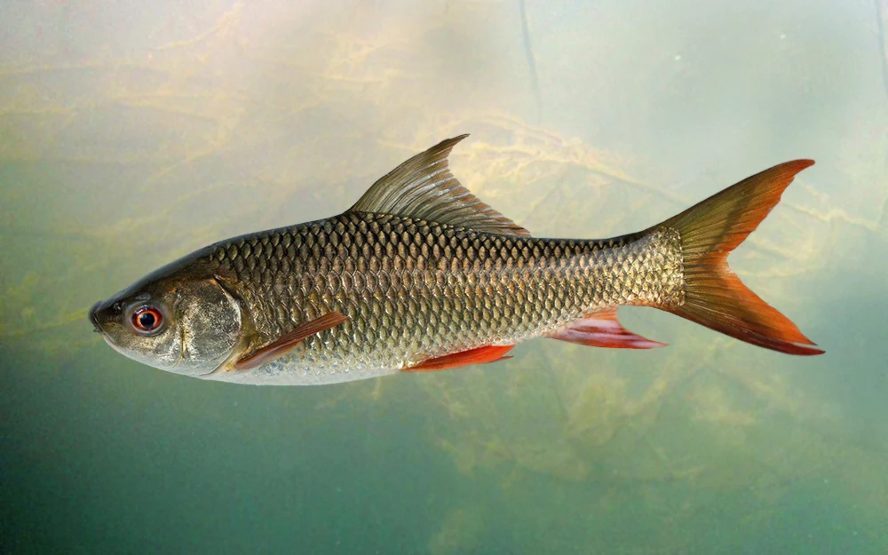
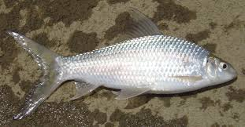
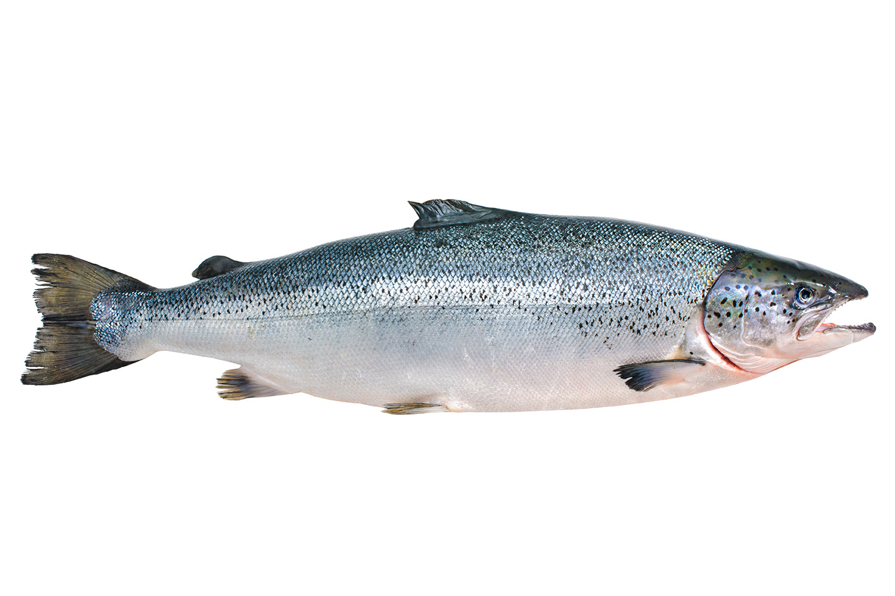

# An Image Recognizer

This image recognizer is able to specify 10 different types of fishes that can be commonly found in South Asia. It is made to aid your journey in buying fish at the bazars of South Asia. 

 

  <a href="south_asian_fish_recognition.html">
    Try it now!
  </a>

 

## Fish Types Overview

| Image | Name | Description |
|:------:|:-----|:-------------|
|  | **Hilsa Fish** | National fish of Bangladesh; rich, oily flavor, prized for traditional dishes. |
|  | **Rohu Fish** | Common South Asian carp; mild flavor and tender flesh. |
|  | **Catla Fish** | Large freshwater fish with broad head and white, flaky meat. |
|  | **Barramundi Fish** | Found in Indo-Pacific waters; firm texture and buttery taste. |
|  | **Mrigal Carp Fish** | Popular aquaculture species; lean meat with subtle flavor. |
|  | **Indian Featherback Fish** | Elongated body and delicate flesh; used in spicy curries. |
|  | **Salmon Fish** | Rich in omega-3; pink meat and distinctive flavor. |
|  | **Pabda Catfish** | Small, soft-boned fish known for its smooth, buttery texture. |
|  | **Silver Pomfret** | Flat, silvery marine fish; mild and tender, prized in Asia. |
|  | **Bombay Duck Fish** | Despite its name, it’s a fish; salty, aromatic, often sun-dried. |

<link rel="stylesheet" href="dark.css">
